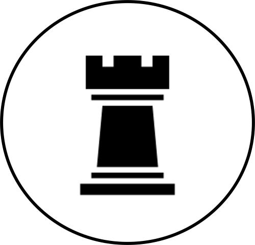

[![Contributors][contributors-shield]][contributors-url]
[![Forks][forks-shield]][forks-url]
[![Stargazers][stars-shield]][stars-url]
[![Issues][issues-shield]][issues-url]
[![LinkedIn][linkedin-shield]][linkedin-url]

<!-- PROJECT LOGO -->
 

  

<h3 align="center">project_title</h3>

  

    project_description
     
    <a href="https://github.com/ir4un/pt-v01"><strong>Explore the docs »</strong></a>
     
     
    <a href="https://ir4un.com">View Demo</a>
    ·
    <a href="https://github.com/ir4un/pt-v01/issues/new?labels=bug&template=bug-report---.md">Report Bug</a>
    ·
    <a href="https://github.com/ir4un/pt-v01/issues/new?labels=enhancement&template=feature-request---.md">Request Feature</a>
  

Resources Used:
Youtube-
1. On-Scroll Reveal Animation with React & Framer Motion - https://www.youtube.com/watch?v=hjbxaYTMhy0&t=171s
   
2. Framer Motion (for React) - https://youtu.be/2V1WK-3HQNk?si=GUd_iBUAG38Gvc0C
   
3. The Framer Motion Crash Course || React Animation Library 2023 - https://youtu.be/znbCa4Rr054?si=sZ6y2cS9s-0LZ_wn
   
4. How To Smooth Scroll in React - Smooth Scrolling Tutorial -https://youtu.be/QzW03hyw_bU?si=a85D68EWvS4XtICZ
   
5. Mouse Hover Tilt Card Effect || React, Framer Motion & Tailwind CSS - https://youtu.be/-PBw8mv9ZYc?si=o3CI1tfyXhXOqlB2
   
6. Sending Emails from React App with EmailJS | Step-by-Step Tutorial - https://youtu.be/wWiTouBHibs?si=5hgHlVj2ghBfUnB_

7. How to rename a folder inside GitHub without forking it to the local system || Easiest approach 💯- https://www.youtube.com/watch?v=quqHLtxNHCI
   
8. Html5 CSS3 Cube Shape - Cube inside a Transparent Cube - Pure CSS Shape Tutorial - https://www.youtube.com/watch?v=H2D51Ql8Kco

9. Setup a Custom Domain in Netlify in 5 Minutes - https://www.youtube.com/watch?v=bY7Tkh9Vz8I 
    
10. Make React Audio Player with Controls & Waveform - https://www.youtube.com/watch?v=rT6GiYEIdGs

React Components:
1. Carousel - https://codesandbox.io/p/sandbox/github/linkstrifer/react-carousel/tree/main/?file=%2Fsrc%2Fstyles.css

2. Angled Button - https://codemyui.com/pure-css-cartoon-style-angled-button/

Misc Resources:
1. Bliss Animated Wallpaper - https://moewalls.com/landscape/bliss-windows-xp-live-wallpaper/

2. React Icons - https://react-icons.github.io/react-icons/

3. Gradient Generator - https://cssgradient.io/

4. MUI Templates - https://mui.com/material-ui/getting-started/templates/

5. Space Animation - https://www.codewithrandom.com/2023/11/21/css-star-animation/

6. Beautiful CSS 3D Transform Examples - https://polypane.app/css-3d-transform-examples/